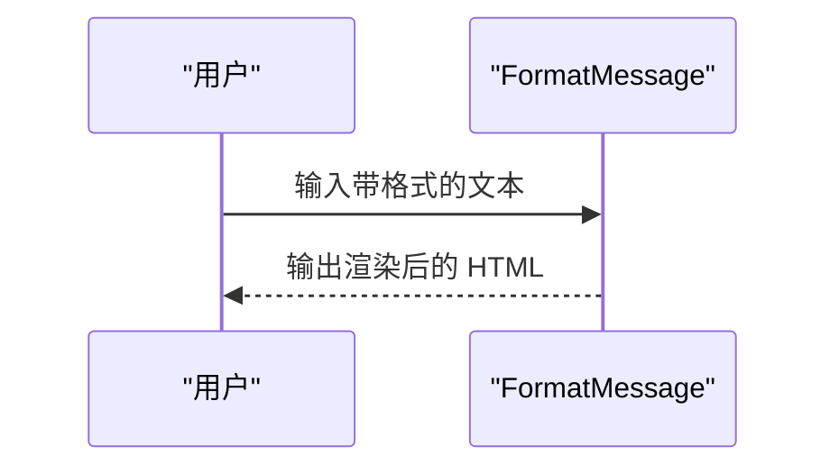

# 文本格式展示 Demo

该示例演示 `FormatMessage` 组件如何解析并渲染不同的文本格式。通过调整 `textFormatting` 配置，可以自定义符号与效果的对应关系。

```mermaid
sequenceDiagram
    participant U as "用户"
    participant C as "FormatMessage"
    U->>C: 输入带格式的文本
    C-->>U: 输出渲染后的 HTML
```

本目录下的 `FormatMessageDemo.vue` 提供了最简单的使用方式，方便开发者了解如何在项目中集成。
