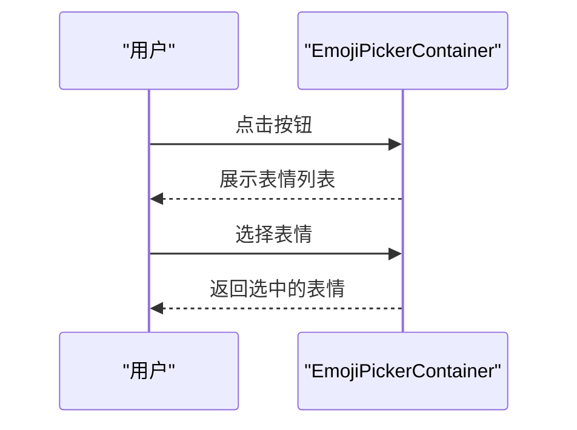

# 表情选择器 Demo

该示例演示如何单独使用 `EmojiPickerContainer` 组件。点击按钮即可出现表情选择面板，选中表情后会通过事件回调给父组件处理。

```mermaid
sequenceDiagram
    participant U as "用户"
    participant E as "EmojiPickerContainer"
    U->>E: 点击按钮
    E-->>U: 展示表情列表
    U->>E: 选择表情
    E-->>U: 返回选中的表情
```

`EmojiPickerDemo.vue` 提供了最基础的用法，开发者可在此基础上扩展自己的逻辑。
