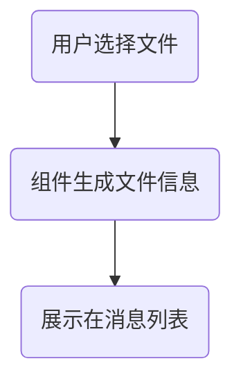

# 附件消息 Demo

通过 `vue-advanced-chat` 组件可以轻松展示图片、视频及语音等多种消息类型。本示例构造了含有图片和语音的两条消息，运行后即可看到对应的预览与播放控制。

```mermaid
flowchart TD
    A("用户选择文件") --> B("组件生成文件信息")
    B --> C("展示在消息列表")
```

开发者可根据实际业务将文件上传逻辑补充到 `messages` 数据中，实现完整的发送流程。
