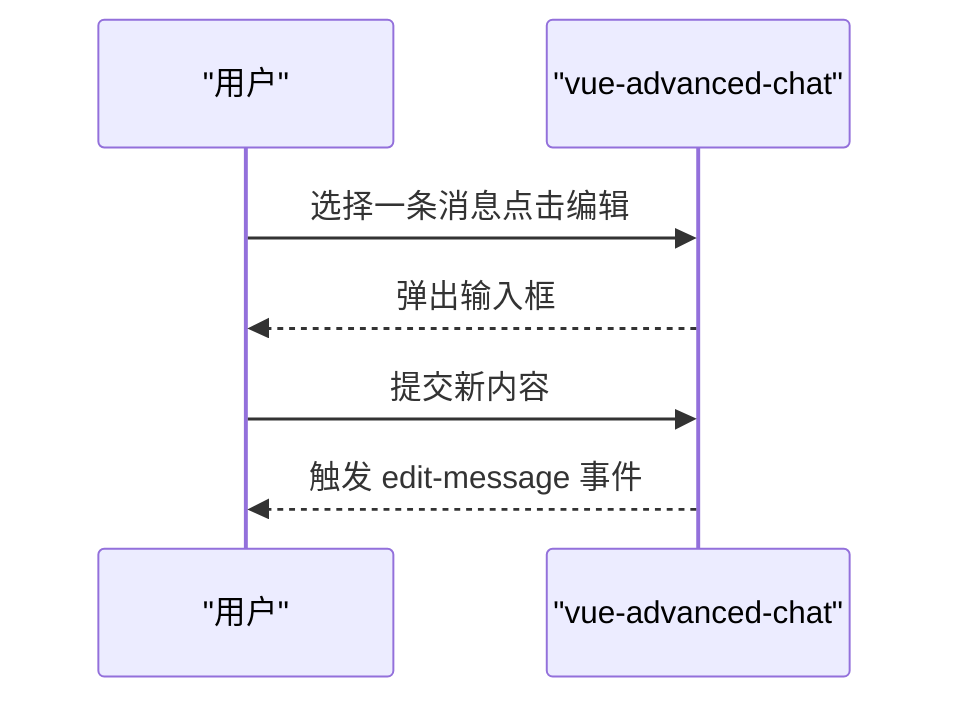

# 编辑与回复 Demo

此示例展示消息的编辑与回复功能。通过监听 `edit-message` 及 `send-message` 事件，可在外部处理修改后的内容或被回复的消息。

```mermaid
sequenceDiagram
    participant U as "用户"
    participant C as "vue-advanced-chat"
    U->>C: 选择一条消息点击编辑
    C-->>U: 弹出输入框
    U->>C: 提交新内容
    C-->>U: 触发 edit-message 事件
```

更多逻辑（如保存至后台）可在事件回调中实现。
