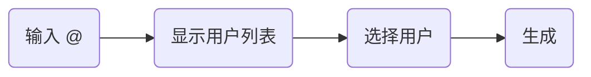

# 用户标签 Demo

在输入框中键入 `@` 会触发用户列表选择，发送消息后会在内容中生成可点击的标签。

```mermaid
flowchart LR
    A("输入 @") --> B("显示用户列表")
    B --> C("选择用户")
    C --> D("生成 <usertag>")
```

在 `open-user-tag` 事件中可获取被点击的用户信息，便于实现私聊或其它功能。
