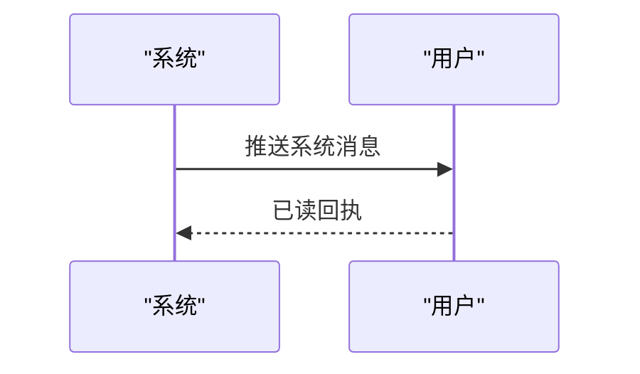

# 消息状态 Demo

展示不同状态下消息的显示效果，包括系统消息、未读标记和已读标记等。

```mermaid
sequenceDiagram
    participant S as "系统"
    participant U as "用户"
    S->>U: 推送系统消息
    U-->>S: 已读回执
```

通过 `seen`、`new`、`system` 等字段控制消息状态，可根据业务需要扩展更多显示方式。
