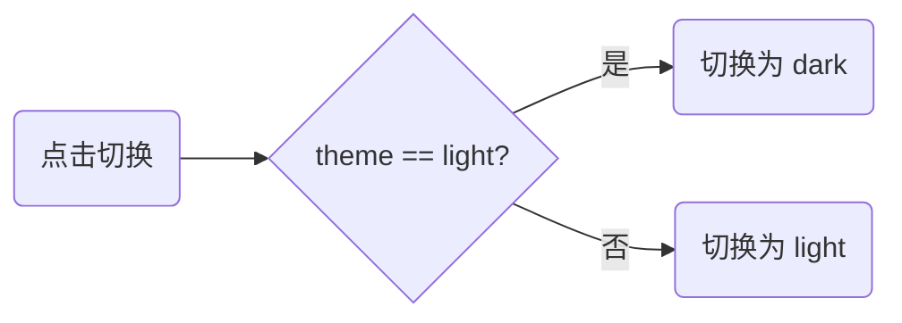

# 主题切换 Demo

使用 `theme` 属性可在亮色和暗色模式之间切换。示例通过按钮动态修改主题值，即时影响聊天窗口样式。

```mermaid
flowchart LR
    A("点击切换") --> B{"theme == light?"}
    B -- 是 --> C("切换为 dark")
    B -- 否 --> D("切换为 light")
```

开发者可将此逻辑集成到自身的主题管理体系中。
